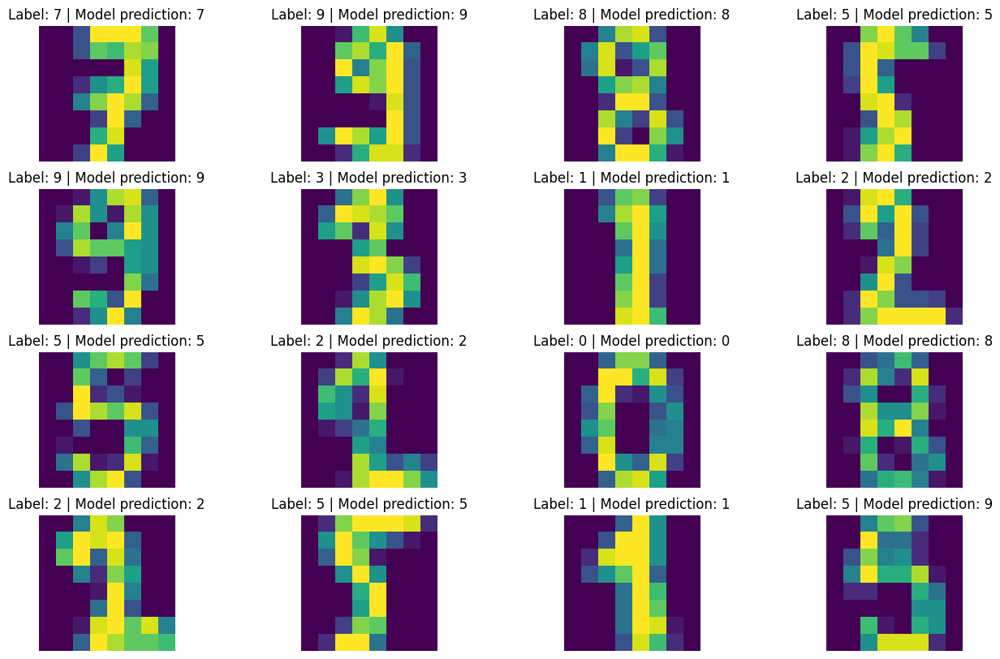
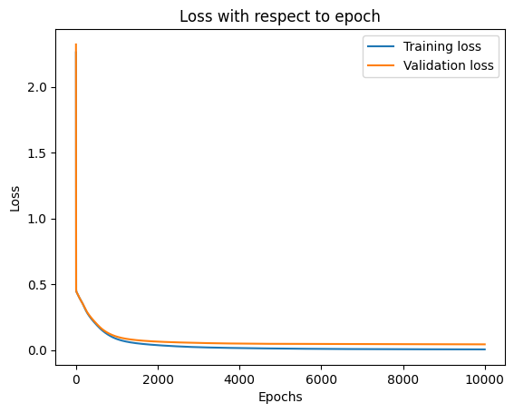

# MNIST-Neural-Network

This repository contains an implementation of training a neural network using backpropagation from scratch.

## Key features

- Coded by me from scratch in Python
- Supports any network architecture
- Tested using the MNIST digits dataset
- Uses both training and validation datasets

## Code explanation

### Training loop

The main training loop runs for a specified number of epochs. For each epoch:

1. Forward pass is performed through the network to compute weighted inputs (Z) and activations (A) for each layer.
2. Loss is computed using the mean squared error loss function for both the training and validation datasets.
3. Backward pass is performed to calculate the gradients and update the weights of the network.

### Backpropagation

The backpropagation process involves computing the gradients of the loss with respect to the weights. The gradients are then used to adjust the weights in the opposite direction to minimise the loss.

## Training and validation loss

